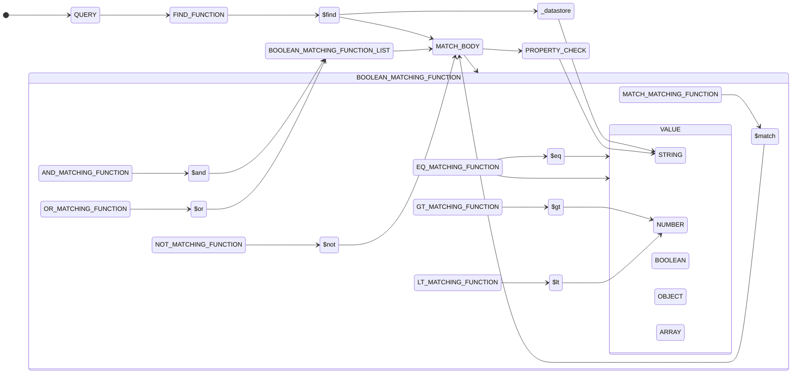
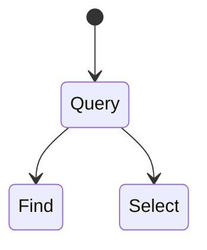

<div id="top"></div>
<!--
*** Thanks for checking out the Best-README-Template. If you have a suggestion
*** that would make this better, please fork the repo and create a pull request
*** or simply open an issue with the tag "enhancement".
*** Don't forget to give the project a star!
*** Thanks again! Now go create something AMAZING! :D
-->


<!-- PROJECT SHIELDS -->
<!--
*** I'm using markdown "reference style" links for readability.
*** Reference links are enclosed in brackets [ ] instead of parentheses ( ).
*** See the bottom of this document for the declaration of the reference variables
*** for contributors-url, forks-url, etc. This is an optional, concise syntax you may use.
*** https://www.markdownguide.org/basic-syntax/#reference-style-links
-->
[![Contributors][contributors-shield]][contributors-url]
[![Forks][forks-shield]][forks-url]
[![Stargazers][stars-shield]][stars-url]
[![Issues][issues-shield]][issues-url]
[![MIT License][license-shield]][license-url]


<!-- PROJECT LOGO -->
<br />
<div align="center">
  <!-- <a href="https://github.com/lenra-io/template-hello-world-node12">
    
  </a> -->

<h3 align="center">Lenra Query Parser</h3>

  <p align="center">
    This repository provides an parser that can parse JSON query into an AST tree and parse this tree into Ecto query that can be execute with elixir.
    <br />
    <br />
    <!-- <a href="https://github.com/lenra-io/template-hello-world-node12">View Demo</a>
    · -->
    <a href="https://github.com/lenra-io/query-parser/issues">Report Bug</a>
    ·
    <a href="https://github.com/lenra-io/query-parser/issues">Request Feature</a>
  </p>
</div>

<!-- GETTING STARTED -->
## Getting Started

### Prerequisites

You need to add this lib into your phoenix app : 
```bash
    {:query_parser, git: "https://github.com/lenra-io/query-parser.git", tag: "v1.0.0-beta.X"}
```

<p align="right">(<a href="#top">back to top</a>)</p>

## Parser

The parser are in two step: 
- Parse JSON query into an AST tree
- Pasre the tree into JSON

The query format can be describe with:


    
### AST

  The representation of the AST:



### Ecto


<p align="right">(<a href="#top">back to top</a>)</p>

<!-- USAGE EXAMPLES -->
## Query

  This is some exemples of how to use query function

### And

### Eq

### Contains

### In

### Or


<p align="right">(<a href="#top">back to top</a>)</p>


<!-- CONTRIBUTING -->
## Contributing

Contributions are what make the open source community such an amazing place to learn, inspire, and create. Any contributions you make are **greatly appreciated**.

If you have a suggestion that would make this better, please open an issue with the tag "enhancement" or "bug".
Don't forget to give the project a star! Thanks again!

<p align="right">(<a href="#top">back to top</a>)</p>


<!-- LICENSE -->
## License

Distributed under the **MIT** License. See [LICENSE](./LICENSE) for more information.

<p align="right">(<a href="#top">back to top</a>)</p>


<!-- CONTACT -->
## Contact

Lenra - [@lenra_dev](https://twitter.com/lenra_dev) - contact@lenra.io

Project Link: [https://github.com/lenra-io/query-parser](https://github.com/lenra-io/query-parser)

<p align="right">(<a href="#top">back to top</a>)</p>


<!-- MARKDOWN LINKS & IMAGES -->
<!-- https://www.markdownguide.org/basic-syntax/#reference-style-links -->
[contributors-shield]: https://img.shields.io/github/contributors/lenra-io/template-hello-world-node12.svg?style=for-the-badge
[contributors-url]: https://github.com/lenra-io/query-parser/graphs/contributors
[forks-shield]: https://img.shields.io/github/forks/lenra-io/template-hello-world-node12.svg?style=for-the-badge
[forks-url]: https://github.com/lenra-io/query-parser/network/members
[stars-shield]: https://img.shields.io/github/stars/lenra-io/template-hello-world-node12.svg?style=for-the-badge
[stars-url]: https://github.com/lenra-io/query-parser/stargazers
[issues-shield]: https://img.shields.io/github/issues/lenra-io/template-hello-world-node12.svg?style=for-the-badge
[issues-url]: https://github.com/lenra-io/query-parser/issues
[license-shield]: https://img.shields.io/github/license/lenra-io/template-hello-world-node12.svg?style=for-the-badge
[license-url]: https://github.com/lenra-io/query-parser/blob/master/LICENSE.txt
